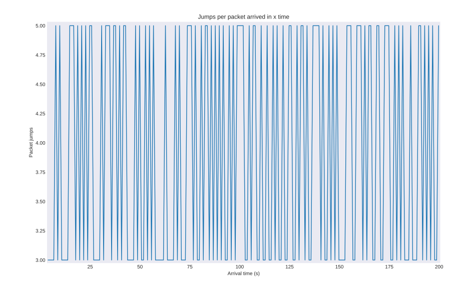

# Laboratorio enrutamiento

* Baudino Geremias
geremiasbaudino@mi.unc.edu.ar
* Mollea Maria Agustina
agustina.mollea@mi.unc.edu.ar

## Indice

- [Laboratorio enrutamiento](#laboratorio-enrutamiento)
  - [Indice](#indice)
  - [Introducción](#introducción)
  - [Implementación](#implementación)
    - [Simulación](#simulación)
      - [Dependencias](#dependencias)
    - [Gráficos](#gráficos)
  - [Tarea Analisis](#tarea-analisis)
  - [Tarea de Diseño](#tarea-de-diseño)
  - [Punto Estrella](#punto-estrella)
  - [Conclusiones](#conclusiones)

## Introducción

Este proyecto consiste en analizar modelos de red con multiples entradas/salidas y diseñar un protocolo de enrutamiento bajo diferentes topologías para poder comprender el efecto que estos tienen sobre el desempeño de la red.

Para esto, la cátedra brindó un modelo de red de anillo con 8 nodos, en donde cada uno cuenta con dos interfaces de comunicación full-duplex con dos posibles vecinos.

En el interior de cada nodo, se encuentran dos capas de enlace (link o lnk, una conectada con cada vecino), una capa de red (net) y una capa de aplicación (app). Estas capas de aplicación y enlace se encargan de generar tráfico y almacenar datos en búferes.

## Implementación

Para la implementación de este proyecto se utilizó el lenguaje de programación C++ y la herramienta de simulación de redes OMNeT++.

### Simulación

Para correr desde la terminal las simulaciones se debe usar el comando `make case1` en caso de que se quiera correr la simulacion del caso 1 o `make case2` en caso de que se quiera correr la simulacion del caso 2. 

Al ejecutarlo se crearan dentro del directorio *plot* dos directorios llamados "case1" y "case2" en donde se encontraran los graficos correspondientes a cada uno. A su vez, también se crea un directorio *data*, el cual contendra todos los archivos .csv generados por la simulacion, sin embargo este se borra instantaneamente al finalizar la simulacion.

Cabe aclarar que este make funciona si es utilizado para realizar la para para parte 2 ya que se encuentra incorporado en el proyeco el código del algoritmo de enrutamiento.

#### Dependencias

Para poder correr la simulación junto con la herramienta para graficar es necesario tener instalado Omnet++, agregar omnet al path, tener instalado python3 y las librerias pandas, matplotlib y numpy.

### Gráficos

Para poder graficar los datos obtenidos de la simulación se utilizó python3 junto con las librerias pandas, matplotlib y numpy, las cuales se encargan de leer y formatear los datos de los archivos .csv generados por la simulación y graficarlos.

Además, muchos de los grafícos que se consideraban relevantes para realizar el analisis de la simulación se obtuvieron directamente desde omnet++.

## Tarea Analisis

El analisis de la simulación se debia realizar con las fuentes de tráfico configuradas de la siguiente manera:

* caso1: node[0] y node[2] transmitiendo datos a node[5]

* caso2: todos los nodos generan tráfico hacia el node[5]

Las metricas que se tomaron son las que parecian relevantes con respecto al problema a resolver, el cual es enrutar paquetes de manera que deba hacer la menor cantidad de saltos hasta llegar a su destino, abstrayendonos, al menos un poco, del problema de congestión tratado en el anterior laboratorio. Estas metricas son:

- Delay: tiempo que tarda un paquete en llegar a su destino.
- Número de saltos: cantidad de nodos por los que pasa un paquete hasta llegar a su destino.
- Uso de los buffers: cantidad de paquetes que se encuentran en el buffer de cada nodo a lo largo del tiempo.

Las metricas sugieren que la red es mal utilizada al hacer uso del algoritmo naive propuesto inicialmente dado que sobrecargamos nodos intermedios innecesariamente, omitiendo que existe un mejor camino por tomar. Vease la comparación en la cantidad de saltos y en general en el uso de la red entre la parte 1 y parte 2 de un mismo caso:

| parte 1                                          | parte 2                                          |
| ----------------------------------------------- | ----------------------------------------------- |
|  |  |
|   |  |
|  |  |
|  |  |
|    |  |

El uso de los recursos de la red puede mejorarse realizando un óptimo enrutamiento para cada paquete, que es lo que se pide realizar en la parte 2, en donde se puede observar que el uso de la red es más eficiente. En general basta ver a ambos algoritmos funcionar para notarlo, pero luego las métricas lo confirman.

Si al hablar de equilibrio en la red nos referimos a cuando no hay nodos congestionados y la cantidad de paquetes que se envian son similares a la cantidad de paquetes que se reciben, esto se logra en distintos arrivalTime dependiendo tanto de la topología de la red como del algoritmo usado (si el inicial o el implementado), pero reduciendonos a la topología de anillo y los algoritmos usados, al correr la simulación con diferentes interArrivaltime explorando los resultados encontramos que el equilibrio se logra con un interArrivalTime de aproximadamente 8 para el algoritmo inicial y aproximadamente 4 para el algoritmo implementado, dejando ver claramente que el algoritmo implementado usa mejor los recursos de la red.

## Tarea de Diseño

La tarea de diseño consistia en la implementación de un algoritmo de enrutamiento para una red de topología anillo con 8 nodos. Por lo que en primer lugar se creó una estregia de enrutamiento especifico para esa red, en donde cada nodo se enteraba de la existencia de sus vecinos por medio de los hello packets y a la hora de elegir el camino optimo, se comparaban las distancias entre el destino y el vecino izquierdo y el destino y el vecino derecho, y se elegia el camino con la distancia mas corta.

Al analizar los distintos casos se pudo observar que el algoritmo no funcionaba correctamente debido a que trataba a la red como una recta real en lugar de un anillo ya que los nodos al desconocer los vecinos de sus vecinos no tenian en cuenta que las puntas de la red estaban conectadas, por lo que a veces no se elegia el camino mas corto.

En lugar de descartar la idea por completo, se opto por mantener la parte del codigo en donde cada nodo se enteraba de quienes eran sus vecinos por medio de hello packets y además incorporarle ciertas herramientas que fueron explicadas en las clases teoricas de la materia, como por ejemplo el algoritmo de inundación y el uso del algoritmo de busqueda en anchura (BFS) para poder encontrar el camino mas corto. La explicación de esta estrategia de enrutamiento se encuentra en el apartado punto estrella de este informe ya que directamente se implemento para que funcione con cualquier topología y cantidad de interfaces por nodo.

Una vez aplicado el algoritmo final a la red de anillo, se procedio a realizar la simulación de la misma y se obtuvieron los siguientes resultados:

| parte 1                                          | parte 2                                          |
| ----------------------------------------------- | ----------------------------------------------- |
|  |  |
|   |  |
|  |  |
|  |  |
|    |  |

Al ver los gráficos y en general al observar los comportamientos de los algoritmos de enrutamiento, tanto el propuesto por la cátedra como el implementado por nosotros, se deja notar que los algoritmos no tienen ningun tipo de comparación para redes irregulares, ahora bien reduciendonos a la red de topologia anillo, la mejora introducida por el algoritmo implementado por nosotros se ve pero es pequeña al tratarse de una red sencilla, la diferencia va a hacerse mas evidente a medida que el anillo crezca y por ejemplo un nodo que tiene como vecino al destino a su derecha, use el algoritmo inicial donde siempre se va hacia la misma direccion (supongamos izquierda) y deba darle toda la vuelta a el anillo haciendo n-1 saltos (donde n es la cantidad de nodos del anillo) en vez de tan solo 1, sobrecargando todos los nodos intermedios y obteniendo un delay **mucho** mas grande que con la estrategia mas coherente de elegir el camino mas corto.

No existen loops de enrutamiento en el algoritmo, dado que a la hora de calcular el camino mas corto se utiliza el algoritmo de busqueda en anchura (BFS) que es un algoritmo que no permite que se formen ciclos.

En cuanto a la mejora que puede hacerse, el algoritmo actual si bien siempre elige el camino más corto (el que menos saltos requiera), de haber 2 con la misma distancia al destino, siempre elegira el mismo, lo que podria saturar un nodo/camino en particular cuando podria "randomizarse" la eleccion del camino a seguir entre los que tengan la misma (la minima) distancia al destino evitando asi la situación de sobrecarga.

## Punto Estrella

Como tarea estrella de este laboratorio la cátedra propuso diseñar una estrategia de enrutamiento que sea capaz de adaptarse a cualquier topología y cantidad de interfaces por nodo; por lo que brindaron el siguiente modelo de red:

Podria decirse que el algoritmo implementado se divide en 3 partes: el reconocimiento local (hello packets), la distribución de datos y el algoritmo de enrutamiento.

En primer lugar, el reconocimiento de la red comienza con los hello packets, los cuales se envian a todos los vecinos de un nodo informandoles a cada uno que él es su vecino. 

Una vez que se completo el reconocimiento local, se procede a enviar los *data_packet* que contienen información acerca del source y un arreglo de todos los vecinos de ese nodo. Esto se hace por medio del algoritmo de inundación, el cual consiste en enviar el paquete a todos los vecinos excepto al que lo envio, marcando como recibida la información del nodo que generó el *data_packet* para que en el caso de volver a recibir un paquete de ese nodo, no retransmitirlo.
Estos paquetes se usan para generar una tabla de vecinos de cada nodo en la red, para luego poder utilizarla a la hora de calcular el camino óptimo para cada paquete.

Finalmente, se utiliza el algoritmo de busqueda en anchura (BFS) para encontrar el camino mas corto entre el nodo que genera el paquete y el destino teniendo en cuenta la tabla de vecinos generada anteriormente. El algoritmo utiliza una cola para almacenar los nodos a visitar, y utiliza mapas para realizar un seguimiento de los nodos visitados, los nodos anteriores en el camino más corto y las distancias desde el nodo fuente. Comienza desde el nodo fuente, marca el nodo como visitado y lo agrega a la cola. Luego, en cada iteración, toma un nodo de la cola, verifica si es el destino y, de lo contrario, explora sus vecinos no visitados. Si encuentra el destino, termina y reconstruye el camino más corto desde el destino hasta el origen. Al final, devuelve el siguiente nodo en el camino más corto, o -1 si no se encontró un camino válido.

Para asegurar que el algoritmo de enrutamiento de la tarea de diseño sea correcto, se optó por crear una nueva red, la cual se encuentra comentada en el archivo *network.ned*. Si bien esta red es más sencilla que la del punto estrella, fue util para nosotros el hecho de poder observar cómo a pesar de que las topologías sean diferentes, el algoritmo de enrutamiento sigue funcionando como corresponde.

## Conclusiones

Para concluir, queremos destacar como la implementación de este laboratorio estaba realmente relacionada con los algoritmos y en general con los temas vistos en las clases teóricas de la materia, además de permitirnos relacionarnos más con los conceptos de grafos, algoritmos de búsqueda, algoritmos en general y la solución de problemas de eficiencia en estos (como a la hora de realizar la inundación de paquetes), entre otros problemas que siempre son interesantes de resolver.

La tarea estrella nos obligo a profundizar mucho más en el tema y, a pesar de que no fue simple implementarlo, nos parecio muy interesante el hecho de poder diseñar un algoritmo de enrutamiento que se adapte a cualquier topología, ver como este se comporta en la red y comparar los resultados obtenidos con los de otros algoritmos de enrutamiento, dejando en evidencia las ventajas y diferencias entre ellos.

